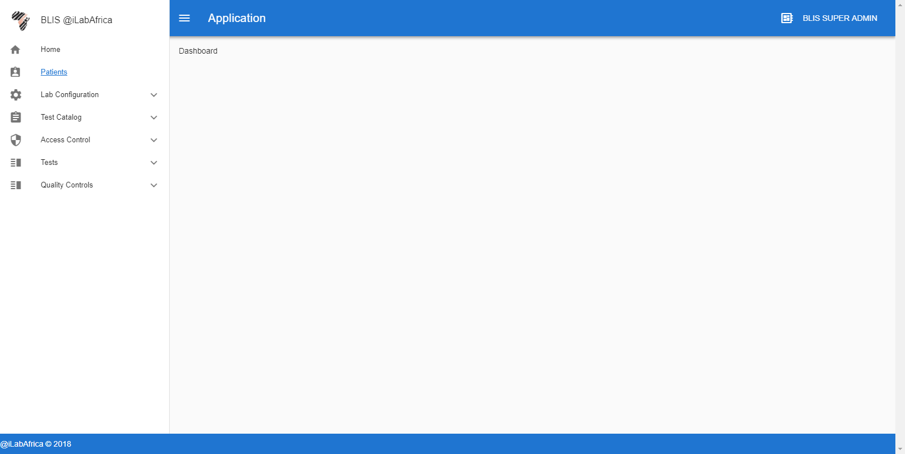
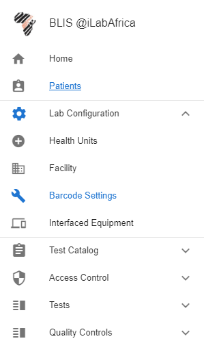

Components
==========

Logging into the Dev environment
********************************

**API Authentication (Passport)**

BLIS v3.0 API uses tokens to authenticate users and does not maintain session state between requests. It therefore uses Laravel Passport, which provides a full OAuth2 server implementation for the application in a matter of minutes. Passport is built on top of the `League OAuth2 server <https://github.com/thephpleague/oauth2-server>`_  that is maintained by Andy Millington and Simon Hamp. More on Laravel Passport `here <https://laravel.com/docs/5.6/passport>`_

**Installation**

#. Install Passport via the Composer package manager: ::

     composer require laravel/passport

#. The Passport service provider registers its own database migration directory with the framework, so you should migrate your database after registering the provider. The Passport migrations will create the tables your application needs to store clients and access tokens: ::

     php artisan migrate

#. Next, you should run the ``passport:install`` command. This command will create the encryption keys needed to generate secure access tokens. In addition, the command will create "personal access" and "password grant" clients which will be used to generate access tokens: ::

	 php artisan passport:install

#. After running this command, add the ``Laravel\Passport\HasApiTokens`` trait to your ``App\User`` model. This trait will provide a few helper methods to your model which allow you to inspect the authenticated user's token and scopes: ::

	 <?php

	 namespace App;

	 use Laravel\Passport\HasApiTokens;
	 use Illuminate\Notifications\Notifiable;
	 use Illuminate\Foundation\Auth\User as Authenticatable;

	 class User extends Authenticatable
	 {
	     use HasApiTokens, Notifiable;
	 }

#. Next, you should call the ``Passport: :routes`` method within the ``boot`` method of your AuthServiceProvider. This method will register the routes necessary to issue access tokens and revoke access tokens, clients, and personal access tokens: ::

	 <?php

	 namespace App\Providers;

	 use Laravel\Passport\Passport;
	 use Illuminate\Support\Facades\Gate;
	 use Illuminate\Foundation\Support\Providers\AuthServiceProvider as ServiceProvider;

	 class AuthServiceProvider extends ServiceProvider
	 {
	     /**
	      * The policy mappings for the application.
	      *
	      * @var array
	      */
	     protected $policies = [
	         'App\Model' => 'App\Policies\ModelPolicy',
	     ];

	     /**
	      * Register any authentication / authorization services.
	      *
	      * @return void
	      */
	     public function boot()
	     {
	         $this->registerPolicies();

	         Passport::routes();
	     }
	 }

#. Finally, in your ``config/auth.php`` configuration file, you should set the ``driver`` option of the ``api`` authentication guard to ``passport``. This will instruct your application to use Passport's ``TokenGuard`` when authenticating incoming API requests: ::

	'guards' => [
	    'web' => [
	        'driver' => 'session',
	        'provider' => 'users',
	    ],

	    'api' => [
	        'driver' => 'passport',
	        'provider' => 'users',
	    ],
	],

Logging into the Live System
****************************

The API has a familiar login screen to most systems. Use your assigned Email and Password combinations to gain access into the system. The figure below shows this screen.

.. image:: images/login.PNG
	:align: center

If a wrong combination is used, you shall be notified by a popup.

Main Dashboard (Admin)
**********************

Once Authenticated, Blis V3 provides a compact and easy to use Interface. The number of visible components depends on the Authenticated User's Role and access rights. The image below shows the administrator's view. The admin has access rights to all components.

**Sidebar**

The side bar provides easy access to the components and can be expanded to reveal more items.

